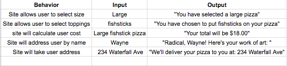

# _Olsen Twin's Pizza_

#### _Epicodus Intro to Programming: Object Oriented Independent Project, June 16, 2017_

#### By _**Michelle Poterek**_

## Description

_This project allows a user to order a theoretical Mary Kate and Ashley pizza!_
* **Users are able to select a size**
* **Users are able to pick their toppings**
* **Users are able to see the price of their pizza**

## Setup/Installation Requirements

_In order to copy this directory to your computer locally:_
* _open Terminal and type:_
* _$ git clone `https://github.com/PoterekM/p-i-z-z-a.git`_
* _$ cd `p-i-z-z-a`_
* _$ open `index.html`_
* _Enjoy theoretical pizza!_

To access this repository remotely click this link:  
https://poterekm.github.io/p-i-z-z-a/

## Support and contact details

_Please feel free to contact me directly via e-mail at poterekm@gmail.com if you have any questions, comments, ideas, or feedback. Also, I invite you to feel empowered to make any changes to this repository by forking it and making changes accordingly._

## Technologies Used

_This project utilizes jQuery (version 3.2.1) and Bootstrap for styling._

### License

*This project is under the MIT License*

Copyright (c) 2017 **Michelle Poterek**
